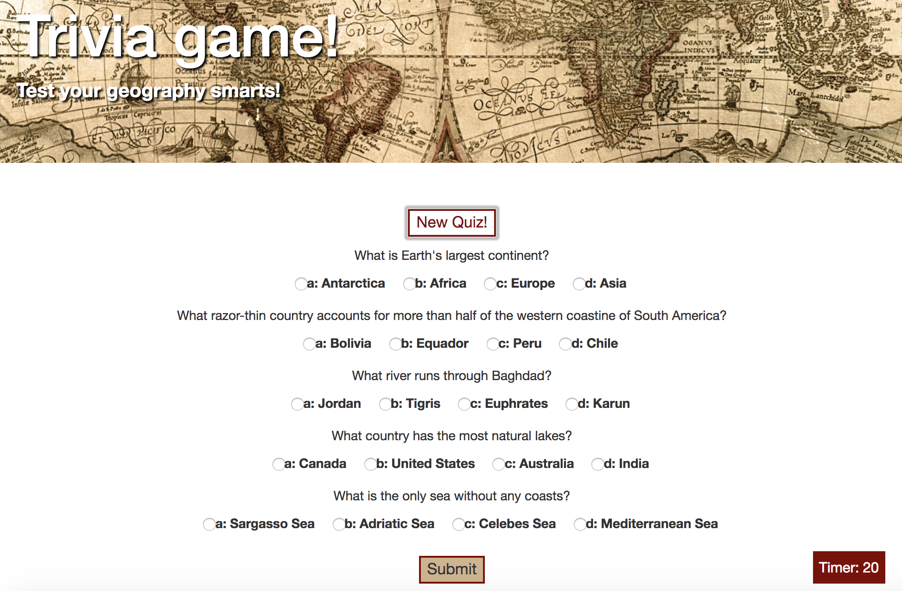
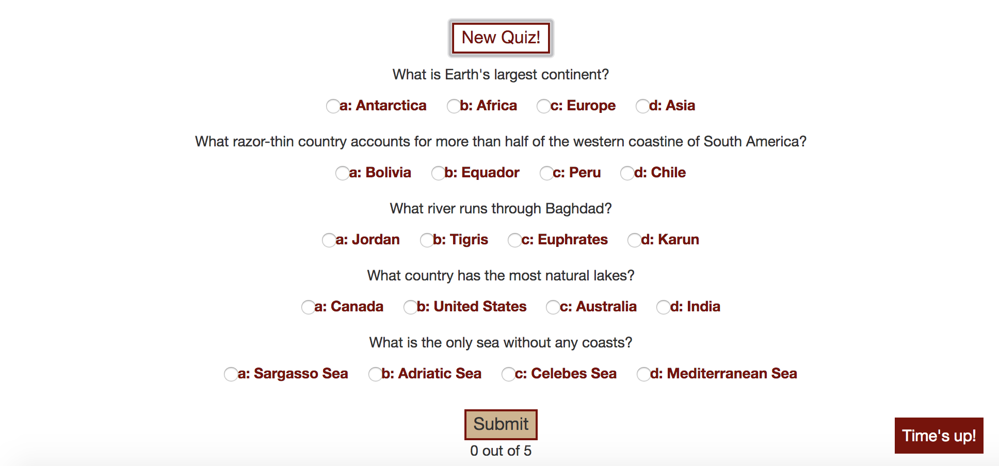
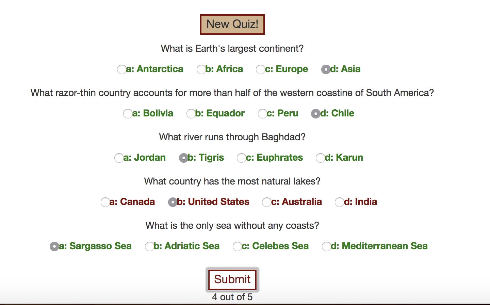

# TriviaGame

### Objective 
Create a trivia game using HTML/CSS, Javascript, and Jquery, focusing on TimeOut requests. 

### Application
User sees the welcome screen

When a new game is started, the questions populate, and the timer starts counting down 

If the game is not submitted by the time the timer runs out, the game is auto-submitted.

Upon submission, the score is given to the user, and the correct/incorrect answers are color-coded accordingly. 

